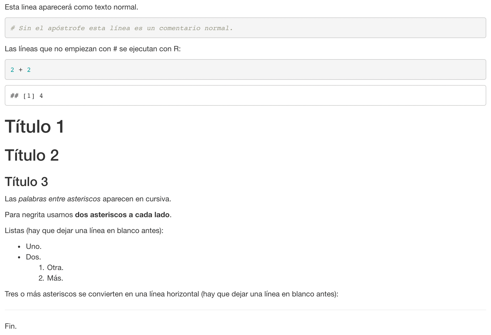
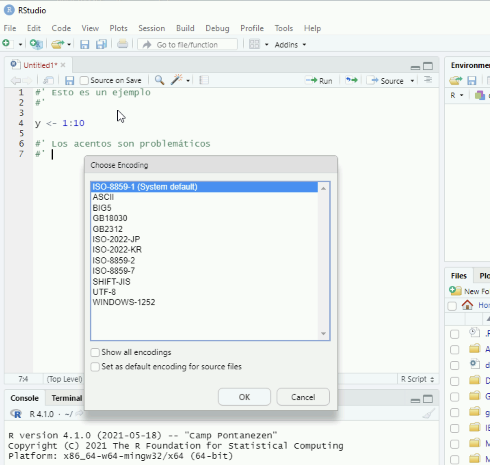
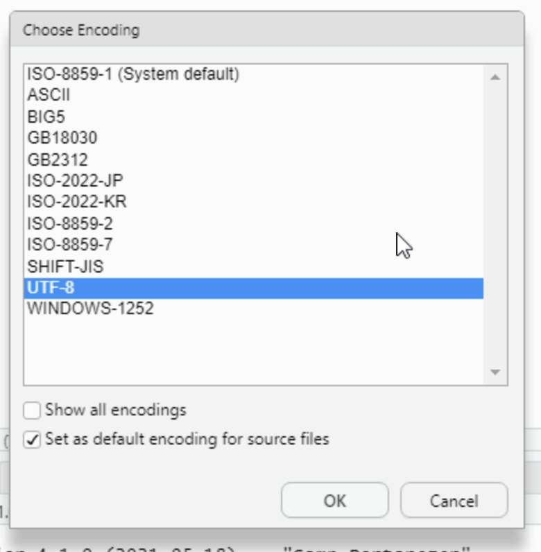
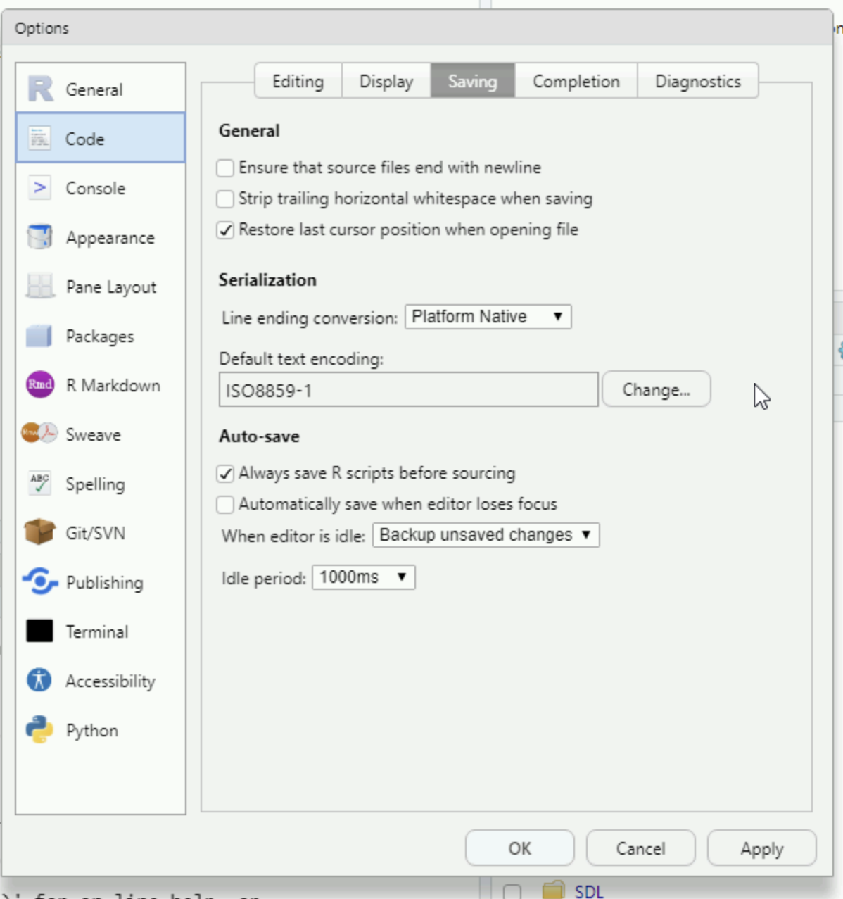
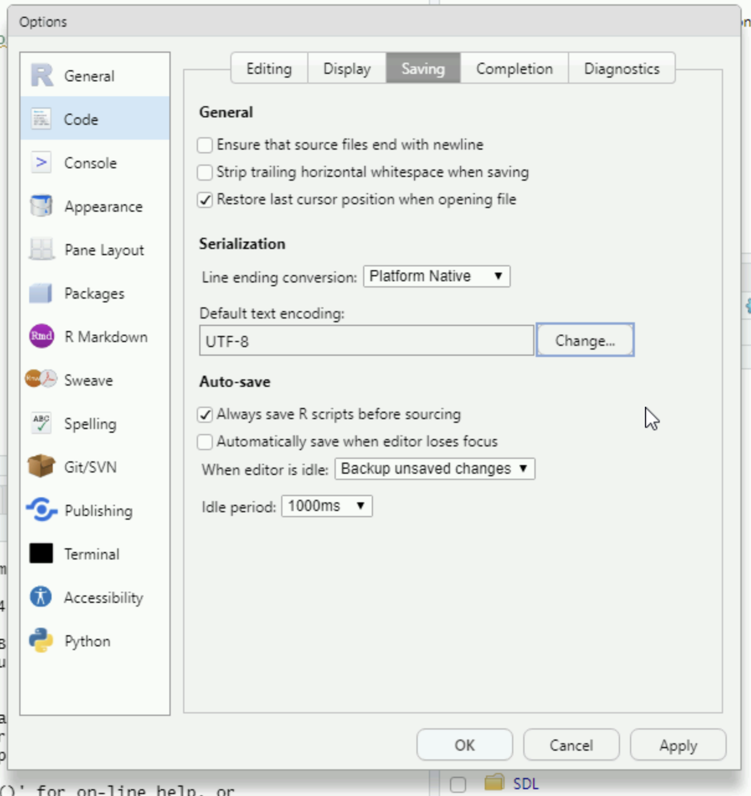
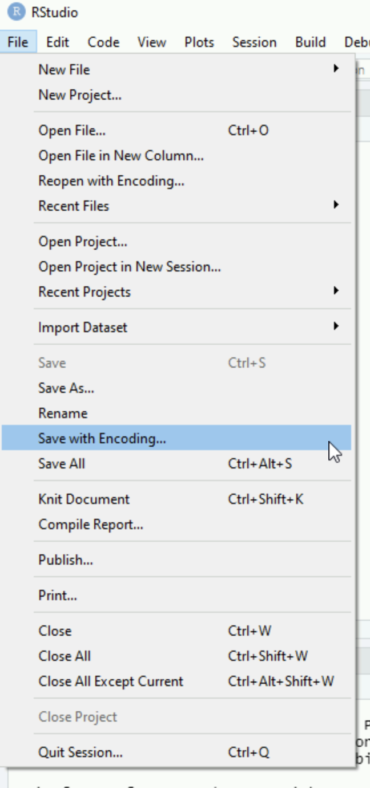
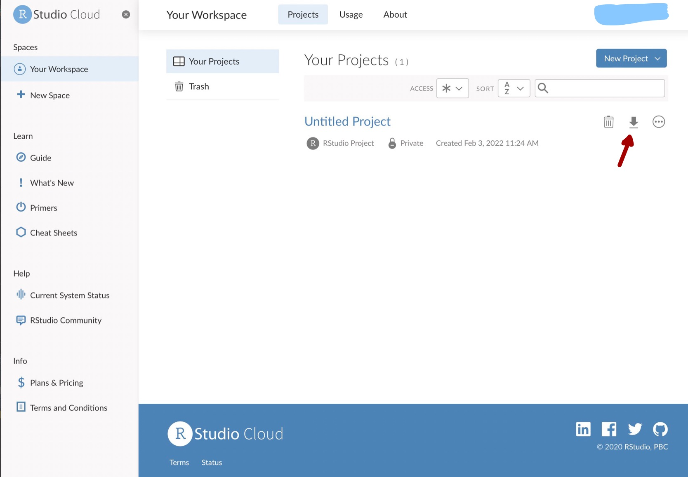

```{r setup, include=FALSE}
knitr::opts_chunk$set(echo = TRUE, comment = "")
```

```{css, echo=FALSE}
.bordered {
  border: 1px solid #aaaaaa;
}
```

# Introducción

RStudio permite, a partir de un archivo con instrucciones de R, generar informes en formato HTML que pueden ser abiertos en cualquier navegador o en Microsoft Word. Los informes contienen:

- Las instrucciones R.

- Los resultados de ejecutar las instrucciones.

- Texto adicional que explique y comente las instrucciones y los resultados.

# Compilar un informe

Para crear un informe no hace falta más que seleccionar el menú `File | Compile report...` y RStudio ejecutará el archivo R que esté abierto en el editor e incluirá todos los resultados y gráficos que generen las instrucciones. 

Es importante tener en cuenta que las instrucciones se ejecutan en una sesión nueva de R. Si se producen errores al compilar un documento pero no cuando se ejecuta en la consola, lo más probable es que falte por añadir alguna instrucción que se ejecutó en la consola pero no está en el archivo R. 

# Añadir texto

Se puede añadir texto a los informes utilizando una forma especial de comentarios. Las líneas que comienzan por los caracteres `#' ` se convierten en texto cuando se compila el informe. Por ejemplo, un archivo que contenga las siguientes líneas:

```
#' Esta linea aparecerá como texto normal.
#'
# Sin el apóstrofe esta línea es un comentario normal.
#'
#' Las líneas que no empiezan con # se ejecutan con R:
2 + 2

#'
#' # Título 1
#'
#' ## Título 2
#'
#' ### Título 3
#'
#' Las *palabras entre asteriscos* aparecen en cursiva.
#'
#' Para negrita usamos **dos asteriscos a cada lado**.
#'
#' Listas (hay que dejar una línea en blanco antes):
#'
#' - Uno.
#' - Dos.
#'   1. Otra.
#'   2. Más.
#'
#' Tres o más asteriscos se convierten en una línea horizontal
#' (hay que dejar una línea en blanco antes):
#'
#' ***
#'
#' Fin.
```

produce al compilarse el siguiente resultado:

:::: {.bordered}



::::


# Problemas comunes en Windows

En Windows es posible encontrarse con errores cuando se escribe texto con acentos u otros caracteres especiales. Cuando se intenta compilar o guardar un archivo que contenga esos caracteres, aparece un cuadro de diálogo solicitando la selección de una codificación de caracteres:

```{r enc-dlg-1-fig, out.width="60%", out.height="60%", fig.align='center', echo=FALSE}

```

Para poder compilar correctamente el documento hay que seleccionar la opción `UTF-8`:

```{r enc-dlg-2-fig, out.width="50%", out.height="50%", fig.align='center', echo=FALSE}

```

También es recomendable marcar la opción `Set as default encoding for source files`, como se muestra en la captura de pantalla anterior.

Se puede establecer `UTF-8` como la opción por defecto para los ficheros R usando el menú `Tools | Global options...` y  cuadro de diálogo que se presenta seleccionar `Code` en el panel izquierdo y la pestaña `Saving`:

```{r global-1-fig, out.width="60%", out.height="60%", fig.align='center', echo=FALSE}

```

Como puede verse en la imagen anterior, la opción por defecto en Windows es guardar los archivos con la codificación `ISO8859-1`. Utilizando el botón `Change...` podemos seleccionar la opción `UTF-8`:

```{r global-2-fig, out.width="60%", out.height="60%", fig.align='center', echo=FALSE}

```

Finalmente, nos podemos encontrar con un fichero que guardamos en una sesión anterior con la codificación incorrecta y que genera errores cada vez que lo intentamos compilar. Solucionamos este problema guardándolo con la codificación `UTF-8` mediante el menú `File | Save with encoding...`

```{r menu-fig, out.width="40%", out.height="40%", fig.align='center', echo=FALSE}

```

# RStudio Cloud

Los informes pueden generarse en [RStudio Cloud](https://rstudio.cloud/). Para descargar los archivos de un proyecto (incluyendo los informes que se hayan generado) utilizamos el icono de descarga que aparece en la página `Your Workspace | Projects` de  RStudio Cloud:

```{r rstudio-cloud-fig, out.width="90%", out.height="90%", fig.align='center', echo=FALSE}

```
